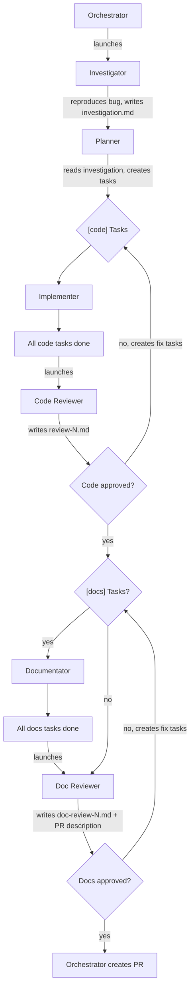

# Team: `bugfix`

For fixing a reported bug. No spec needed — the investigator diagnoses the root cause first.

**Agents:**

| Agent           | Type            | Model | Role                                                                              |
| --------------- | --------------- | ----- | --------------------------------------------------------------------------------- |
| investigator    | `investigator`  | opus  | Reproduces bug, finds root cause via scientific method, writes `investigation.md` |
| planner         | `planner`       | opus  | Reads investigation, creates fix tasks                                            |
| implementer(s)  | `implementer`   | opus  | Implements `[code]` fix tasks + regression test (TDD: red/green/refactor)         |
| code-reviewer   | `code-reviewer` | opus  | Reviews all code changes, reproduces original bug to confirm it's gone            |
| documentator(s) | `documentator`  | opus  | Implements `[docs]` tasks if any (writes/updates documentation)                   |
| doc-reviewer    | `doc-reviewer`  | opus  | Reviews doc changes if any, writes the PR description                             |

**Task rules:**

- Launch a **new implementer/documentator for each task** — do not reuse them across tasks.
- Run implementers **sequentially** and documentators **sequentially**, one at a time, to avoid file conflicts.

**Flow:**

```
1. Orchestrator creates team and launches investigator
2. Investigator reproduces bug → investigates → writes investigation.md with root cause
3. Orchestrator launches planner to read investigation and create fix tasks
4. Orchestrator assigns [code] tasks to implementers
5. Implementer writes regression test FIRST (must fail), then implements fix (test passes)
6. All [code] tasks done → orchestrator launches code-reviewer
7. Code-reviewer reviews all code changes, reproduces original bug, writes review-N.md. Approves or rejects.
8. If rejected → code-reviewer creates fix tasks → orchestrator assigns to implementer → re-review (back to step 6).
9. If approved and there are [docs] tasks → orchestrator assigns them to documentators
10. All [docs] tasks done → orchestrator launches doc-reviewer
11. Doc-reviewer reviews doc changes, writes doc-review-N.md + PR description. Approves or rejects.
12. If rejected → doc-reviewer creates fix tasks → orchestrator assigns to documentator → re-review (back to step 10).
13. If approved (or no [docs] tasks) → orchestrator creates PR using the PR description.
```

Note: if the planner creates no `[docs]` tasks, the doc-reviewer still runs to write the PR description — it just skips the doc review step.


