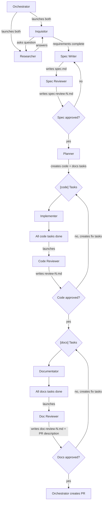

# Team: `prompt-to-code`

From rough idea to merged PR. Combines spec design with implementation.

**Agents:**

| Agent           | Type            | Model | Role                                                                 |
| --------------- | --------------- | ----- | -------------------------------------------------------------------- |
| inquisitor      | `inquisitor`    | opus  | Asks probing questions to the researcher, one at a time (persistent) |
| researcher      | `researcher`    | opus  | Investigates codebase to answer inquisitor's questions (persistent)  |
| spec-writer     | `spec-writer`   | opus  | Synthesizes requirements into spec.md                                |
| spec-reviewer   | `spec-reviewer` | opus  | Reviews spec adversarially, approves or rejects                      |
| planner         | `planner`       | opus  | Reads approved spec, creates `[code]` and `[docs]` tasks             |
| implementer(s)  | `implementer`   | opus  | Implements `[code]` tasks (TDD)                                      |
| code-reviewer   | `code-reviewer` | opus  | Reviews all code changes, writes review-N.md                         |
| documentator(s) | `documentator`  | opus  | Implements `[docs]` tasks (writes/updates documentation)             |
| doc-reviewer    | `doc-reviewer`  | opus  | Reviews all doc changes, writes PR description                       |

**Task rules:**

- Launch a **new implementer/documentator for each task** — do not reuse them across tasks.
- Run implementers **sequentially** and documentators **sequentially**, one at a time, to avoid file conflicts.

**Flow:**

```
1. Orchestrator launches inquisitor and researcher (both persistent)
2. Inquisitor asks a question → orchestrator forwards to researcher
3. Researcher investigates and answers → orchestrator forwards to inquisitor
4. Loop until inquisitor declares requirements complete, writes requirements.md
5. Orchestrator launches spec-writer → writes spec.md
6. Orchestrator launches spec-reviewer → writes spec-review-N.md
7. If rejected → spec-writer revises → spec-reviewer re-reviews (back to step 6)
8. If approved → orchestrator launches planner
9. Planner reads spec → creates [code] and [docs] tasks
10. Orchestrator assigns [code] tasks to implementers (sequentially)
11. All [code] tasks done → orchestrator launches code-reviewer
12. Code-reviewer reviews, writes review-N.md. Approves or rejects.
13. If rejected → code-reviewer creates fix tasks → back to step 10
14. If approved → orchestrator assigns [docs] tasks to documentators (sequentially)
15. All [docs] tasks done → orchestrator launches doc-reviewer
16. Doc-reviewer reviews docs, writes doc-review-N.md + PR description. Approves or rejects.
17. If rejected → doc-reviewer creates fix tasks → back to step 14
18. If approved → orchestrator creates PR using the PR description.
```


