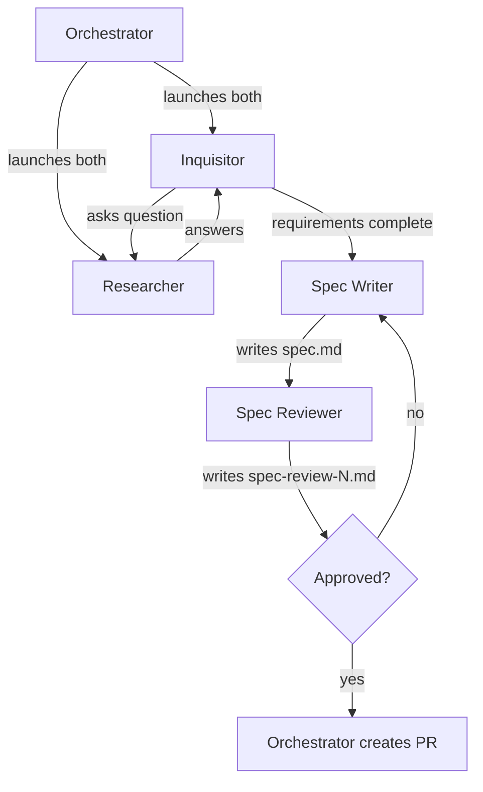

# Team: `prompt-to-spec`

From rough idea to reviewed spec. Produces a spec that can later be used with `spec-to-code`.

**Agents:**

| Agent         | Type            | Model | Role                                                                 |
| ------------- | --------------- | ----- | -------------------------------------------------------------------- |
| inquisitor    | `inquisitor`    | opus  | Asks probing questions to the researcher, one at a time (persistent) |
| researcher    | `researcher`    | opus  | Investigates codebase to answer inquisitor's questions (persistent)  |
| spec-writer   | `spec-writer`   | opus  | Synthesizes requirements into spec.md                                |
| spec-reviewer | `spec-reviewer` | opus  | Reviews spec adversarially, approves or rejects                      |

**Flow:**

```
1. Orchestrator launches inquisitor and researcher (both persistent)
2. Inquisitor asks a question → orchestrator forwards to researcher
3. Researcher investigates and answers → orchestrator forwards to inquisitor
4. Loop until inquisitor declares requirements complete, writes requirements.md
5. Orchestrator launches spec-writer → writes spec.md
6. Orchestrator launches spec-reviewer → writes spec-review-N.md
7. If rejected → spec-writer revises → spec-reviewer re-reviews (back to step 6)
8. If approved → orchestrator creates PR with the spec
```


