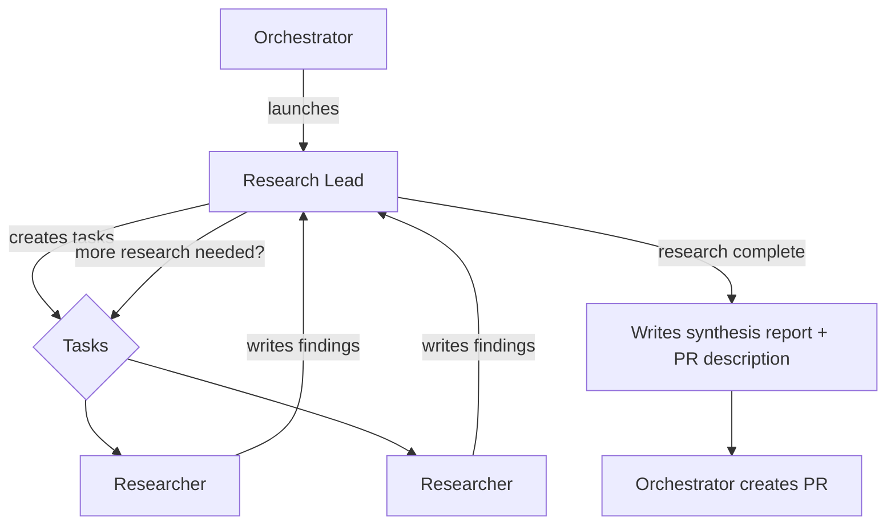

# Team: `research`

For investigating open-ended questions that benefit from structured exploration. A persistent research lead plans the work, researchers execute tasks, and the lead synthesizes findings into a final report.

**Agents:**

| Agent         | Type            | Model | Role                                                                        |
| ------------- | --------------- | ----- | --------------------------------------------------------------------------- |
| research-lead | `research-lead` | opus  | Plans tasks, evaluates findings, iterates, writes final synthesis (persistent) |
| researcher(s) | `researcher`    | opus  | Executes research tasks: codebase, web, experiments, browser tests          |

**Flow:**

```
1. Orchestrator launches research-lead (persistent)
2. Research-lead reads issue, creates research tasks (wave 1)
3. Orchestrator assigns tasks to researchers (in parallel where possible)
4. Researchers investigate, write findings, commit, report to team lead
5. Orchestrator forwards findings to research-lead
6. Research-lead evaluates findings, decides:
   - Need more research? → creates new tasks (back to step 3)
   - Research complete? → writes final synthesis report + PR description
7. Orchestrator creates PR with the research report
```


