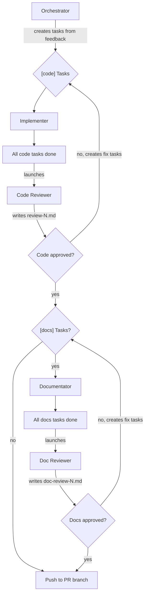

# Team: `review`

For addressing review feedback on an existing PR. The orchestrator creates tasks from the owner's requested changes, implementers fix them, and reviewers verify.

**Agents:**

| Agent           | Type            | Model | Role                                                         |
| --------------- | --------------- | ----- | ------------------------------------------------------------ |
| implementer(s)  | `implementer`   | opus  | Implements `[code]` requested changes                        |
| code-reviewer   | `code-reviewer` | opus  | Reviews all code changes, writes review-N.md                 |
| documentator(s) | `documentator`  | opus  | Implements `[docs]` tasks if any                             |
| doc-reviewer    | `doc-reviewer`  | opus  | Reviews doc changes if any, updates PR description if needed |

**Task rules:**

- Launch a **new implementer/documentator for each task** — do not reuse them across tasks.
- Run implementers **sequentially** and documentators **sequentially**, one at a time, to avoid file conflicts.

**Flow:**

```
1. Orchestrator creates [code] and [docs] tasks from the owner's requested changes
2. Orchestrator assigns [code] tasks to implementers
3. All [code] tasks done → orchestrator launches code-reviewer
4. Code-reviewer reviews, writes review-N.md. Approves or rejects.
5. If rejected → code-reviewer creates fix tasks → back to step 2
6. If approved and there are [docs] tasks → orchestrator assigns them to documentators
7. All [docs] tasks done → orchestrator launches doc-reviewer
8. Doc-reviewer reviews, writes doc-review-N.md. Approves or rejects.
9. If rejected → doc-reviewer creates fix tasks → back to step 6
10. If approved (or no [docs] tasks) → push changes to the PR branch
```


