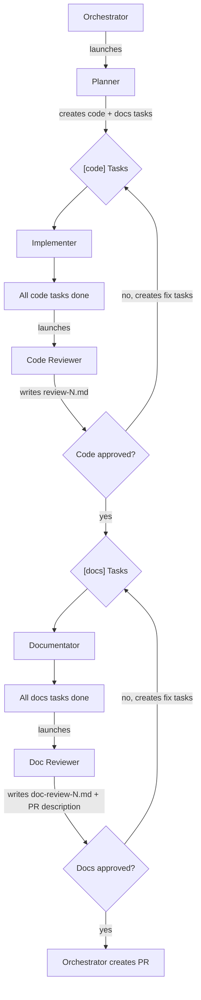

# Team: `spec-to-code`

From existing spec to merged PR. The spec should already exist in `issues/<issue-slug>/spec.md`. If it lives elsewhere (e.g., from a previous `prompt-to-spec` issue), copy it to the issue folder — it must be self-contained.

**Agents:**

| Agent           | Type            | Model | Role                                                                   |
| --------------- | --------------- | ----- | ---------------------------------------------------------------------- |
| planner         | `planner`       | opus  | Reads spec, breaks into atomic `[code]` and `[docs]` tasks             |
| implementer(s)  | `implementer`   | opus  | Implements `[code]` tasks (TDD)                                        |
| code-reviewer   | `code-reviewer` | opus  | Reviews all code changes (includes visual verification for UI changes) |
| documentator(s) | `documentator`  | opus  | Implements `[docs]` tasks (writes/updates documentation)               |
| doc-reviewer    | `doc-reviewer`  | opus  | Reviews all doc changes, writes the PR description                     |

**Task rules:**

- Launch a **new implementer/documentator for each task** — do not reuse them across tasks.
- Run implementers **sequentially** and documentators **sequentially**, one at a time, to avoid file conflicts.

**Flow:**

```
1. Orchestrator creates team and launches planner
2. Planner reads spec → creates [code] and [docs] tasks in task list
3. Orchestrator assigns [code] tasks to implementers (sequentially)
4. All [code] tasks done → orchestrator launches code-reviewer
5. Code-reviewer reviews code changes, writes review-N.md. Approves or rejects.
6. If rejected → code-reviewer creates fix tasks → orchestrator assigns to implementer → re-review (back to step 4).
7. If approved → orchestrator assigns [docs] tasks to documentators (sequentially)
8. All [docs] tasks done → orchestrator launches doc-reviewer
9. Doc-reviewer reviews doc changes and writes PR description. Approves or rejects.
10. If rejected → doc-reviewer creates fix tasks → orchestrator assigns to documentator → re-review (back to step 8).
11. If approved → orchestrator creates PR using the PR description.
```


